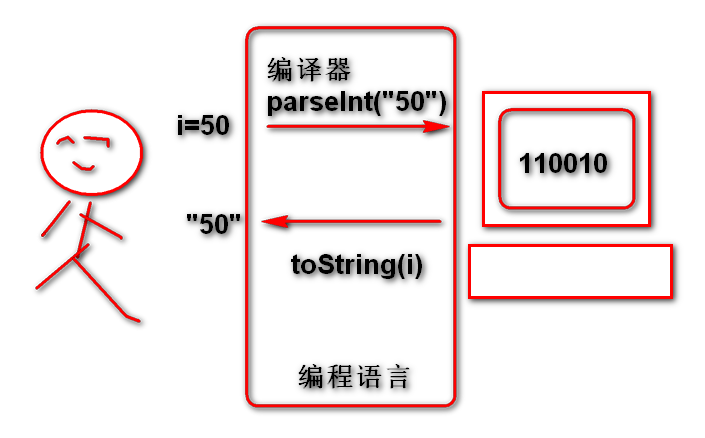
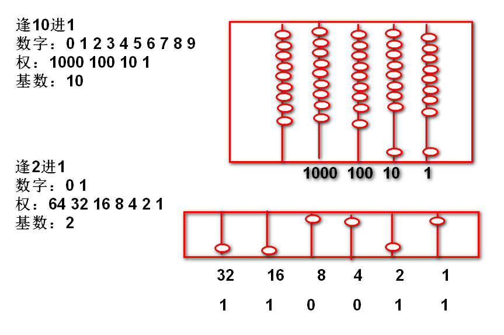
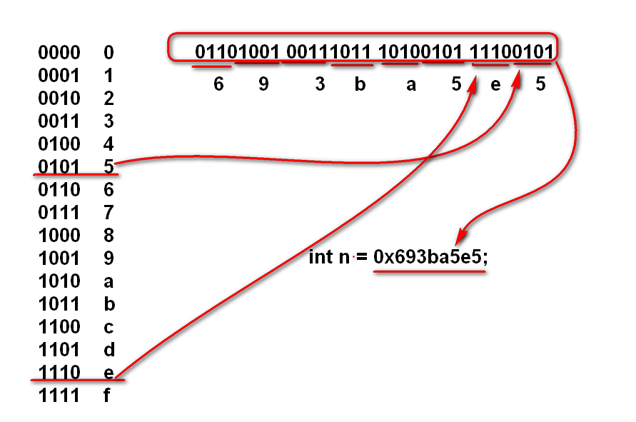
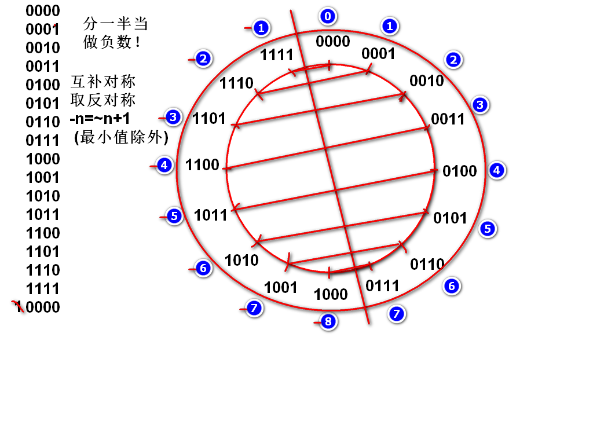
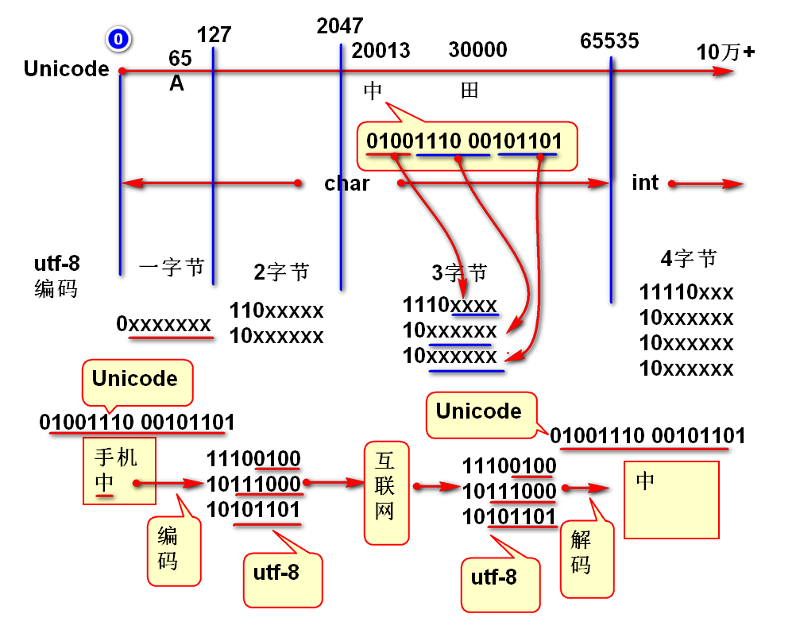

# 2 进制

逢2进一的计数规则。

2进制的计算机成本最优。

原则： 计算机内部的一切都是2进制数据！

案例：

	int i = 50;
	//i 在计算机内部就是2进制的！ 
	System.out.println(Integer.toBinaryString(i));
	System.out.println(i);//"50"

## 2进制

逢2进一的计数规则。

案例：

	public static void main(String[] args) {
		for(int i=0;i<=50; i++){
			System.out.println(
					Integer.toBinaryString(i));
		}
	}

## 16进制

16进制：用于简写（缩写）2进制数据。可以将每个4位2进制缩写为一个16进制数

2进制的书写非常繁琐

	01101001 00111111 01010101 01110101

案例：

	public static void main(String[] args) {
		int n = 0x693ba5e5;
		System.out.println(
				Integer.toBinaryString(n)); 
		// 将2进制缩写为16进制，并且验证缩写的正确性
		// 01110101 11111101 10101111 01011110
		// 7   5    f   d    a   f    5   e
		n = 0x75fdaf5e;
		System.out.println(
			Integer.toBinaryString(n));
		n = 50;
		System.out.println(
			Integer.toBinaryString(n));
	}

## 补码

案例：

	public static void main(String[] args) {
		for(int i=-50; i<=50; i++){
			System.out.println(
				Integer.toBinaryString(i)); 
		}
	}

案例：

	public static void main(String[] args) {
		int max = Integer.MAX_VALUE;
		System.out.println(
			Integer.toBinaryString(max));
		int min = Integer.MIN_VALUE;
		System.out.println(
			Integer.toBinaryString(min)); 
		max = 0x7fffffff;
		min = 0x80000000;
		int i = 0xffffffff;
		System.out.println(max);
		System.out.println(min);
		System.out.println(i);//-1
	}

补码的互补对称现象：
	public static void main(String[] args) {
		int n = -3;
		System.out.println(
				Integer.toBinaryString(n));
		System.out.println(
				Integer.toBinaryString(~n));
		System.out.println(
				Integer.toBinaryString(~n+1));
		int m = ~n+1;
		System.out.println(m);//3
	}

经典面试题：

	int i = 0xffffffff;
	System.out.println(i);
	如上代码的输出结果：
	A.2147483647 B.-2147483648 C.2147483648 D.-1
	答案: D

	int i = 0x80000000;
	System.out.println(i);
	如上代码的输出结果：
	A.2147483647 B.-2147483648 C.2147483648 D.-1
	答案： B

	正数溢出数负数 （错的）
	正数溢出以后是随机数（错的）

	int n = 5;
	System.out.println(~n+1);
	答案：（-5）

	int n = 5;
	System.out.println(~n);
	答案：（-6）

	int n = -5;
	System.out.println(~n);
	答案：（4）

	int n = 0xfffffffe;    //11111111 11111111 11111111 11111110 
	System.out.println(~n);//00000000 00000000 00000000 00000001
	答案：（1）

## 2进制运算符

- 取反 ~
- 与 &
- 或 |
- 左移位运算 <<
- 数学右移位 >>
- 逻辑右移位 >>>

位运算的用途： 文字的编码

字符： char 类型 16位
互联网数据： 8位

如果利用互联网传送字符吗必须将字符拆分为byte（8位）进行传送

将字符拆分为字节的拆分方案称为字符的编码。

最简单的拆分方案： UTF-16BE， 将字符一分为二，无论中文还是英文都是2字节编码。英文浪费1个字节，支持65535个字符。

	A:  00000000 01000001 65
	B:  00000000 01000010 66
	中：01001110 00101101 20013

Unicode: 一个符号一个不重复的数，已经编码了10万+个符号了。

Java char类型支持编码数量： 65535 个字符，Java 建议利用int类型支持扩展的Unicode。

UTF-8：变长编码，英文一个字节，中文3字节，支持4字节编码，支持100万+字符。

输出字符的Unicode

	public static void main(String[] args) {
		int n = '中';
		System.out.println(
				Integer.toBinaryString(n)); 
	}

### 与运算 & （逻辑乘法）

规则：

	0 & 0 = 0
	0 & 1 = 0
	1 & 0 = 0
	1 & 1 = 1

两个数，对其位置，上下计数与

案例：

	n =   00000000 00000000 01001110 00101101
	m =   00000000 00000000 00000000 00111111  mask  掩码
	k=n&m 00000000 00000000 00000000 00101101	

代码：

	int n = 0x4e2d;
	int m = 0x3f;//掩码
	int k = n&m;
	System.out.println(Integer.toBinaryString(n));
	System.out.println(Integer.toBinaryString(m));
	System.out.println(Integer.toBinaryString(k));

### 或运算 | (逻辑加)

规则:

	0 | 0 = 0
	0 | 1 = 1
	1 | 0 = 1
	1 | 1 = 1

案例： 
	
	n =     00000000 00000000 00000000 10000000
	m =     00000000 00000000 00000000 00101011
	k =n|m  00000000 00000000 00000000 10101011

代码：
	
	int n = 0x80;
	int m = 0x2b;
	int k = n|m;
	System.out.println(Integer.toBinaryString(n));
	System.out.println(Integer.toBinaryString(m));
	System.out.println(Integer.toBinaryString(k));	

	n =   00000000 00000000 01001110 00101101

案例： 将字符数据（Unicode）编码为UTF-8编码

	int c = '中';
		
	int b3 = 0x80|c&0x3f;
	int b2 = 0x80|(c>>>6) & 0x3f;
	int b1 = 0xe0|(c>>>12) & 0xf;

案例： 将UTF-8编码解码为字符数据（Unicode）

	int cc =((b1 & 0xf)<<12) | 
			((b2 & 0x3f)<<6) | 
			(b3 & 0x3f);
	char ch = (char)cc;
	System.out.println(ch); 

## 移位计算的数学意义

移动小数点计算：

	如： 1234278.  小数点向右移动
	结果 12342780. 相差10倍
	结果 123427800. 相差100倍

	如果小数点不动，则数字向左移动
	如：   1234278.  小数点向右移动
	结果  12342780. 相差10倍
	结果 123427800. 相差100倍

推广： 2进制时候数字向左移动一次数字扩大2倍！

案例：

	n  =      00000000 00000000 00000000 00110010  50
	m = n<<1  0000000 00000000 00000000 001100100  100   
	k = n<<2  000000 00000000 00000000 0011001000  200

代码验证

	int n = 50;
	int m = n<<1;
	int k = n<<2;
	输出 n m k 的2进制和10进制数据

面试题目：

	优化计算 n*8 为 （  ）
	答案： n<<3

### 区别 >>>  >> 
	
数学右移位 >> ： 其结果满足数学规律, 整除向小方向取整，负数移位，高位补1 结果还是负数。

	n =      00000000 00000000 00000000 00110010  50
	m = n>>1 000000000 00000000 00000000 0011001  25
	k = n>>2 0000000000 00000000 00000000 001100  12

	n =      11111111 11111111 11111111 11001110  -50 
	m = n>>1 111111111 11111111 11111111 1100111  -25
	k = n>>2 1111111111 11111111 11111111 110011  -13 

逻辑右移位 >>> ： 无论正负高位都补0！

	n =       00000000 00000000 00000000 00110010  50
	m = n>>>1 000000000 00000000 00000000 0011001  25
	k = n>>>2 0000000000 00000000 00000000 001100  12

	n =       11111111 11111111 11111111 11001110  -50 
	m = n>>>1 011111111 11111111 11111111 1100111  
	k = n>>>2 0011111111 11111111 11111111 110011   

面试题目

	优化计算表达式 n=n+n/2 (n+=n/2) n>0 
	答案： n += n>>1
	 
---------------------

## 作业

1. 将字符编码为UTF-8字节
2. 将UTF-8的编码解码为字符
3. 完成方法（只考虑全部是中文情况）：

		//将utf8编码的字节数组解码为字符串
		public static String toString(byte[] utf8){
				
		}
		
		//将字符串编码为UTF8字节数组
		public static byte[] utf8(String str){
			
		}
		
		//将一个字符编码为UTF8数组
		public static byte[] utf8(char ch){
			
		}
		
		//将UTF8数组解码为一个字节
		public char toChar(byte[] bytes){
			
		}

